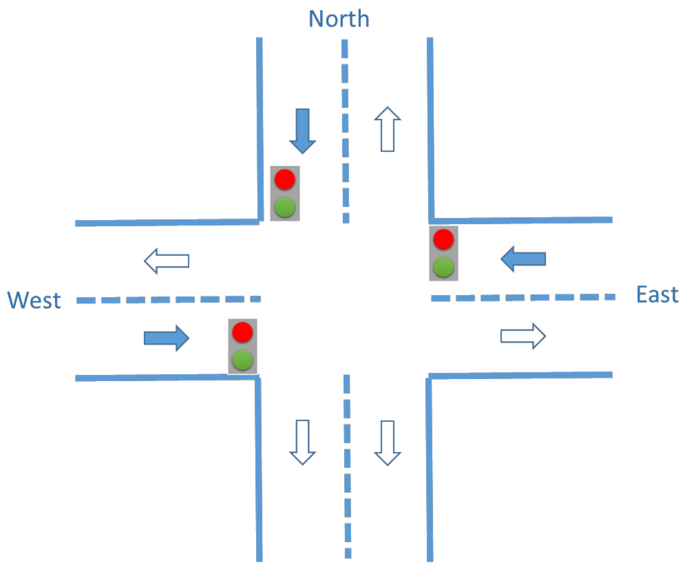

# 🚦 Markov Decision Process for Traffic Control

# Contents
- [Summary](#summary)
- [How to run](#how-to-run)
- [Formal description of the AI model](#formal-description-of-the-ai-model)
  - [Markov Decision Process](#markov-decision-process)
  - [Set of states](#set-of-states)
  - [Set of actions](#set-of-actions)
  - [Transition function](#transition-function)
  - [Cost function](#cost-function)
- [Development](#development)
    - [Design](#design)
    - [Implementation](#implementation)
    - [Testing](#testing)
- [Results](#results)
- [Conclusions](#conclusions)
- [Authors](#authors)

# Summary
A traffic intersection can be approached by vehicles from the North, from the East and from the West.

The flow of vehicles in each direction encounters a traffic light before reaching the intersection, which can be either green or red. An operator must select every 20 seconds which of the three traffic lights to turn green: the other two will automatically turn red.

Sensors measure the level of traffic in each direction prior to the intersection. The values can be: High or Low. When the traffic light in one direction is green, the level will normally stay the same or go down, only very occasionally increasing. When the traffic light is closed, the level stays the same or rises.

We want to design an automaton that opens the appropriate traffic light at each cycle following the optimal policy of the corresponding Markov Decision Process. The target situation is that traffic in all three directions is Low. In such a situation, the automaton stops working.



The objective of this project is to reach a low level of traffic in every direction of a traffic intersection regulated by traffic lights. For this purpose we obtained the optimal policy of a Markov Decision Process (MDP) that is designed at an initial point with eight different states (𝐻𝐻𝐻, 𝐻𝐻𝐿, 𝐻𝐿𝐻, 𝐻𝐿𝐿, 𝐿𝐻𝐻, 𝐿𝐻𝐿, 𝐿𝐿𝐻, 𝐿𝐿𝐿) and three actions (N, E, W), as well as the transition function and probability tables, derived from the given data, and a cost function.

To get the optimal policy we developed a code that computed the expected values by using Bellman Equation and the optimal policy for each state with an associated cost per action of 20, based on the time that each cycle lasts.

This code has been designed in Python trying to be as generic as possible so it can adapt to different sets of states and actions and their costs, and it has been properly tested.

# How to run
To run the code, you need to have Python 3 installed. You can download it from [here](https://www.python.org/downloads/).

Once you have Python installed, you can run the code by executing the following command in the root directory of the project:
```bash
python main.py
```

Note that the data used is contained in Data.csv file as it will be explained in the following sections.

# Formal description of the AI model
## Markov Decision Process

𝑀𝐷𝑃 = <𝑆,𝐴,𝑇,𝐶>

## Set of states

𝑆 = {𝐻𝐻𝐻, 𝐻𝐻𝐿, 𝐻𝐿𝐻, 𝐻𝐿𝐿, 𝐿𝐻𝐻, 𝐿𝐻𝐿, 𝐿𝐿𝐻, 𝐿𝐿𝐿}

The set of states is composed of states ‘s’ with three-character strings. Each character of the string represents the traffic level of each street in the order North, East, West, so that H corresponds to high and L to low. We have computed all different combinations to obtain all possible states.

As the objective is to decrease the traffic level in all directions, the goal state will be LLL.

## Set of actions

𝐴 = {𝑁,𝐸,𝑊}

Each of the actions of the set represent the direction in which the light is turned green in each cycle, being N North, E East, and W West.

## Transition function

𝑇 = 𝑇(𝑠, 𝑎, 𝑠′) = 𝑃(𝑆<sub>𝑡 + 20</sub> = 𝑠′ | 𝐴<sub>𝑡</sub> = 𝑎, 𝑆<sub>𝑡</sub> = 𝑠)

We have considered S<sub>t</sub> as the state when time t is 0s and S<sub>t+20</sub> when time t is 20s, since each cycle when an action is performed lasts a total of 20 seconds.

We will see that each transition has a probability based on the historical data provided (data.csv) that we will use to calculate the probabilities in further sections to calculate the expected values using Bellman Equation as well as the optimal policies. Note that this represents the instant of the time in which we are.

## Cost function

C = C(s, a)

In this specific case, we will use a cost function instead of a reward function since we have considered that opening a semaphore has an associated cost. That is why we have chosen that we have a time cost consisting of 20 seconds, since in the initial state we are at time t = 0s and after the action is fully performed and the new state is obtained, we are in time t = 20s.

As we will see, the cost model we have is stochastic, since an action has a probabilistic effect.

# Development
To start with the development of the project, we have considered three different states. Firstly, a design stage in which we defined what to do and how to fully understand the concept of the project and knowing what were the initial states, the possible operations and the expected results by looking at the final goal we needed to achieve. Afterwards, the implementation phase, which we consider the most important of the project to exactly know what is happening with our data, was performed. In this stage, we needed development of software for performing the operations we wanted, since dealing with big amounts of data can be difficult to handle if we perform operations by hand, so we decided to follow a dynamic programming approach to make the task easier. Finally, after the code was implemented and results were obtained as asked, we needed to test that the results obtained matched the expected ones. Since we had no way of checking that, some tests with a smaller database were done.

## Design
For the design, we have decided to divide the project into four different files, each corresponding to a step of the process and containing the necessary functions.

These files are: probability_calculation.py, that contains the function CalculateProbabilities to get all needed probabilities with the data given, bellman_equation.py, that contains a main function called Bellman Equations that utilizes two auxiliary functions, bellman and summatory to help in making the code more readable and returns the expected values for every state, and optimal_policies.py which contains a main function OptimalPolicies that uses an auxiliary function summary to obtain the optimal policy for each state. Finally, the main.py file declares the needed variables (treated as constants during execution) such as states, actions, cost, etc and calls the functions from the other files.

The design has taken into consideration readability and maintainability, by having a clean and commented code, separated in specific files, and it is also pretty general, as it could easily be changed to accommodate different state and action names and a bigger or smaller amount of them.

## Implementation
For the implementation of the functionality of the processes that must be carried out, we used a dynamic programming approach by the extensive use of Python functions, lists and dictionaries. No libraries were used apart from os library to deal with the file path of the data file and csv library to deal with the opening and reading of information from the csv file with all the data provided.

Since we wanted a generic program that can be used in other similar situations, we decided to use constants in the main program just to change them if needed without having to change all the code. Those constants are:
- **STATES** → States are not the possible states of the plot, but the elements that form the states, which are H (High) and L (Low) in our initial design. After this, all possible states of length 3 will be generated. This list can contain N different elements.
- **ACTIONS** → Possible actions that can be carried out. In our design, we have E (East), W (West), and N (North), which are the actions of putting a light of a semaphore in green. This list can contain N different elements.
- **GOAL_STATES** → It is a simple list with the goal states that we want to consider, being strings composed of items from the constant STATE and with a compulsory length of 3 for this project.
- **COSTS** → Costs are stored in a dictionary whose keys are the different actions (N, E, W) and the values of each key are the associated costs, which are 20 all of them for our design.
- **FILE** → This is the name of the file that we want to use to test or to obtain information. The complete path of the file inside the respective functions.

Just giving the information explained above to the main program in a correct way, we can obtain the transition function of probabilities, the expected values by using Bellman Equation and the optimal policies for each state. This is done in our code in a modular way, by the implementation of four Python files with different functionalities that are called between them.

### probability_calculation.py
This file contains a function, CalculateProbabilities, which receives the state's list, the actions to be performed and the file with the data, and returns a dictionary with the probabilities calculated. In this dictionary, each key is a probability with the form S’|a,S which is stored in this way for the sake of simplicity in further functions. Each key contains a number with the probability of each transition based on the readings of the file provided as parameters.

To perform the operations of probabilities calculations, we have used several dictionaries to carry out the necessary operations, as each row probabilities must sum one. Furthermore, it can be seen in the code that there are commented prints that would help the user to see what is happening after each operation by just using them, being a useful tool for us while debugging during the implementation of the functions.

### bellman_equation.py
The bellman_equation.py contains the main function, BellmanEquation, which receives the list of states, goal state, actions, and costs to compute and return a dictionary with the values for each state. This function calls an auxiliary one called bellman to compute the equations for each individual state and return the minimum out of all. Bellman also uses another auxiliary function called summation, which computes the summation inside the Bellman equation. These decisions have been made in order to make the code more readable. The function from calculate_probabilities.py is used inside to get all of them and use them. This file contains, in fact, the Bellman Equation we saw in class but fully implemented in code.

### optimal_policy.py
The optimal_policy.py contains the main function called OptimalPolicy which calculates the optimal policy for each state and returns a dictionary with all of them. This function is also called an auxiliary one to calculate the summation. Note that we have not included the goal states (LLL in our case) in the final result.

### main.py
Finally, as explained at the beginning of the section, the main file is where the user selects the sets to use. Moreover, we have included a call to BellmanEquation and OptimalPolicy functions to answer the questions that we will see in the next point.

## Testing
For testing purposes, we have used a new database (tests.csv) which contains less information than the original provided (data.csv). We decided to do this in order to perform some Markov iterations by hand and check if our code was working as expected with the complete set of data, since we have not found any way of checking if both the probabilities, expected values and optimal policies where accurate by using the full set of information provided which contains more than 8000 lines of historical data.

# Results
## Is it normal to not have any cases in the input data with low traffic in every direction?
As low traffic in every direction is the goal state, it is obvious that we do not need any data regarding it. However, if that information was provided, it will not matter either, as LLL, because it is the goal state, and therefore, all probabilities associated with it in the summation (summation) of the Bellman equation will be multiplied by zero and the result will stay the same. Otherwise, if the probabilities with LLL are provided and they are not 0, the results could be inconsistent with the problem definition, since we know that the goal state should be LLL and it has no sense to do an action in the automaton while being in the goal state.

## Cost of action
As the cost was not given, we have decided to assign a cost of 20 to each action. The cost of all actions is the same because we do not need to prioritize one over the other, as we just want to reach the final state as much as possible, no matter the order in which we do it. We have setted it to 20 considering the cost as time cost, as this is the amount of seconds that each cycle lasts. Moreover, since the three costs are the same, we could also have considered the cost of unitary (cost 1 for all of them) and the results of the optimal policies would have been the same. Therefore, we have that the cost of the actions are C(a) = 20 ∀ a ∈ A.

## Expected value states
After computing the Bellman equation, we obtain the following expected values for each state. Note that V(LLL) must be 0 since it is a goal state.
- V(HHH) = 794.272892
- V(HHL) = 739.009122
- V(HLH) = 742.130036
- V(HLL) = 587.402741
- V(LHH) = 745.360440
- V(LHL) = 615.223709
- V(LLH) = 593.162010
- V(LLL) = 0

## Optimal policy
After computing the optimal policy, we obtain the following result for each state. The optimal policy for the goal state is not taken into account as it already is the state that we want to reach.
- π* (𝐻𝐻𝐻) = 𝐸
- π* (𝐻𝐻𝐿) = 𝐸
- π* (𝐻𝐿𝐻) = 𝑊
- π* (𝐻𝐿𝐿) = 𝑁
- π* (𝐿𝐻𝐻) = 𝐸
- π* (𝐿𝐻𝐿) = 𝐸
- π* (𝐿𝐿𝐻) = 𝑊

## Problem changes for more directions and levels
If we add more states and traffic values to the problem, it will become more complex adding one more action to the set of actions and severely increasing the number of states from eight to 54. In terms of the resolution, we could still use the same code for the computation after doing minimal changes.

Markov Decision Process:

𝑀𝐷𝑃 = <𝑆, 𝐴, 𝑇, 𝐶>

Set of states:

𝑆 = {𝑝<sup>4</sup>; 𝑝 ∈ 𝐻, 𝑀, 𝐿, 𝑉, 𝐵}

# Conclusions

In conclusion, we have found this project pretty enjoyable, refreshing, and useful. We consider that it has allowed us to dive deeper into the more practical aspects of artificial intelligence and to expand our knowledge of the topics treated and programming of algorithms as a whole.

Although we had some doubts about the resolution at some points, we managed to solve it without any problems by dividing the problem into several sub-problems which were easier to understand and to deal with.

# Authors
- [Raúl Manzanero López-Aguado](https://github.com/RaulMLA)
- [Elena Esther Pajares Palomo](https://github.com/3lenaaa)
